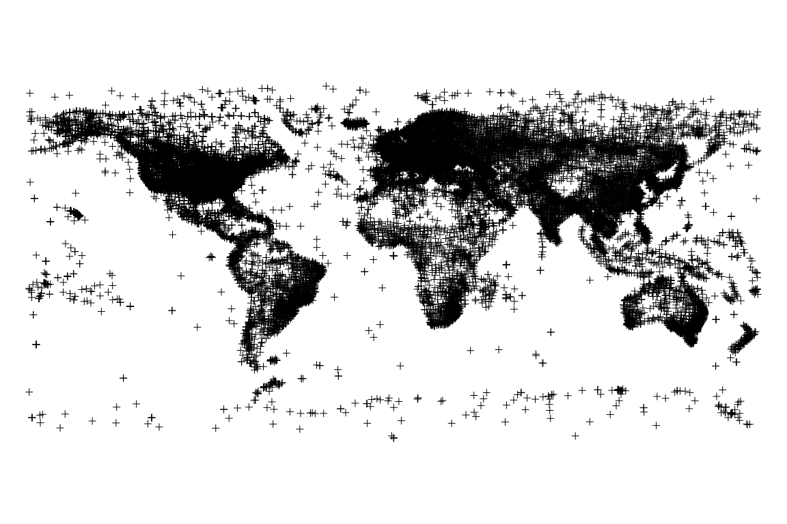
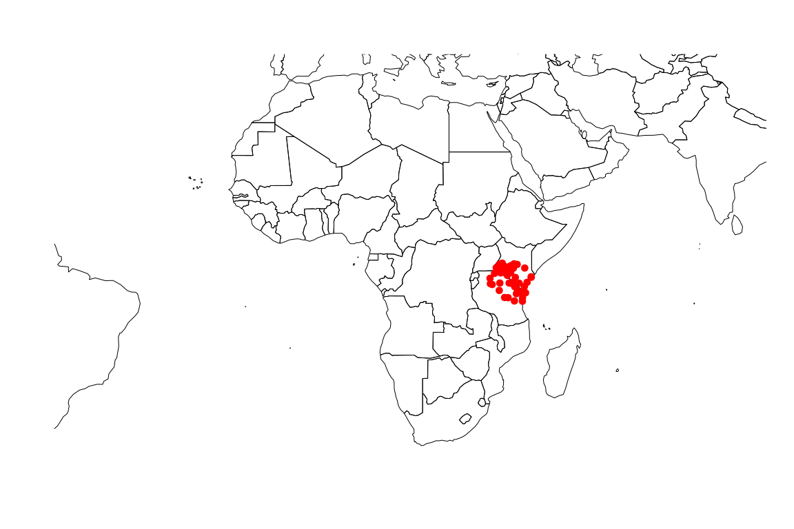
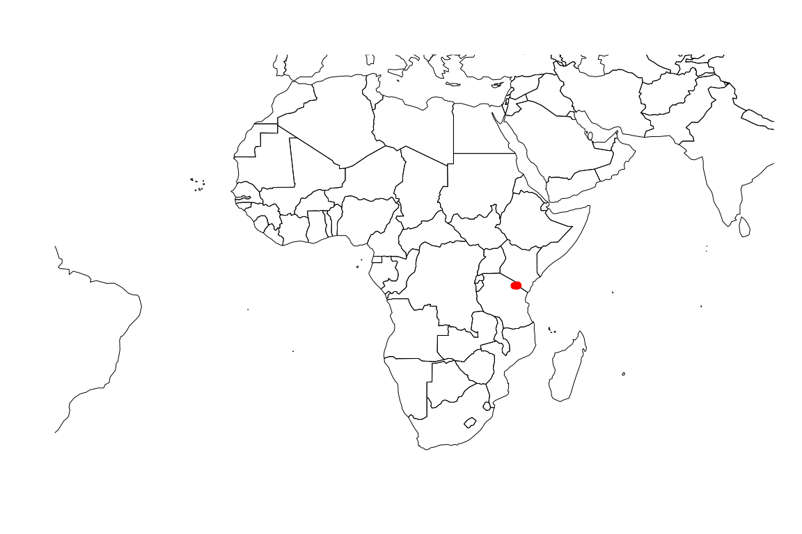
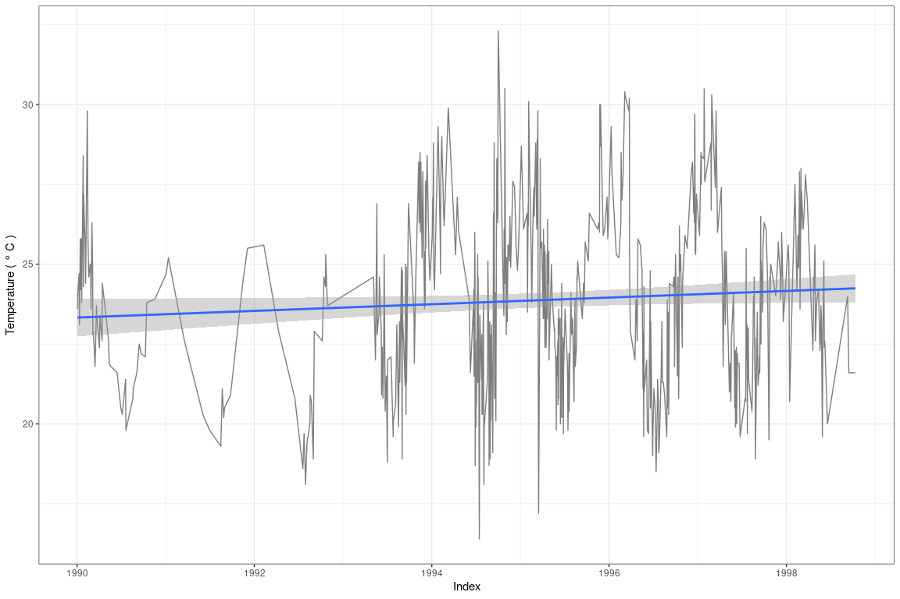

For the latest stable release, please refer to  
.

### What it is all about

But to return to the actual topic: Every person dealing with long-term
climatological data (e.g. of daily air temperature, relative humidity,
and precipitation amounts) will sooner or later stumble across the
Global Summary Of Day (GSOD) climate data collection provided by the
National Oceanic and Atmospheric Association (NOAA). I’ve been recently
looking for available GSOD stations in close vicinity to Mt.
Kilimanjaro, Tanzania, and as I am trying to realize most of my coding
work using R, I quickly noticed that there are only a few packages that
provide convenient tools for processing GSOD data. Therefore, I started
to write this package that includes both downloading data sets of
selected climate stations for a given time span as well as some
processing steps for quality assurance and gap filling.

### Introducing the processing chain

**Getting started**

The starting point for each GSOD-related search query is the selection
of a particular station (or even multiple stations). Although there are
tools that allow interactive station selection and data acquisition, I
thought it was a good thing to implement a couple of search functions to
speed things up a little bit.

The **GSODTools** package comes with a built-in dataset from [NOAA’s FTP
server](ftp://ftp.ncdc.noaa.gov/pub/data/noaa/isd-history.csv) holding
information about all available GSOD stations that is automatically
attached via lazy-loading when loading the package. Let’s have a quick
look at it.

    ##     USAF  WBAN STATION NAME CTRY STATE ICAO   LAT    LON ELEV(M)      BEGIN        END
    ## 1 007018 99999   WXPOD 7018                  0.00  0.000  7018.0 2011-03-09 2013-07-30
    ## 2 007026 99999   WXPOD 7026   AF             0.00  0.000  7026.0 2012-07-13 2017-08-22
    ## 3 007070 99999   WXPOD 7070   AF             0.00  0.000  7070.0 2014-09-23 2015-09-26
    ## 4 008260 99999    WXPOD8270                  0.00  0.000     0.0 2005-01-01 2012-07-31
    ## 5 008268 99999    WXPOD8278   AF            32.95 65.567  1156.7 2010-05-19 2012-03-23
    ## 6 008307 99999   WXPOD 8318   AF             0.00  0.000  8318.0 2010-04-21 2010-04-21

Unfortunately, the data formatting and consistency of this official
table is rather poor. Hence, I thought it might be quite helpful to sort
out some inconveniences above all else. The referring function is called
*gsodReformat()* and allows to reformat elevation (decimeters to meters)
as well as latitude and longitude (thousandth of a degree to whole
degree). Furthermore, it offers the opportunity to remove invalid
coordinates, i.e. values of latitude and longitude exceeding valid
thresholds of +/-90 and +/-180 degrees, respectively. Optionally, the
adjusted dataset can be converted to an object of class `sp` prior to
return.

Consequently, the first lines of code working with **GSODTools** should
probably look like this.

    # Reformat data and convert to spatial object
    gsod_shp <- gsodReformat(data = gsodstations,
                             elevation = TRUE, 
                             coords = TRUE,
                             df2sp = TRUE)

    par(mar = c(0, 0, 0, 0))
    sp::plot(gsod_shp)

**Selecting a station**

Now that the list of available GSOD stations is in a reasonable format
and holds spatial information, the next step would be to select a
station you would like to download data from. Using the GIS Data
Locator, this involves quite some clicking around until you finally
reach the download page. **GSODTools** offers multiple functions to
facilitate station selection and data acquisition, allowing the user to
select stations based on spatial characteristics or by hand.

`stationFromCoords` takes a x (longitude) and y (latitude) coordinate as
input, and returns all available GSOD stations that fall within a
user-defined buffer around that location. Alternatively, a
‘SpatialPoints’ object may be provided rather than two separate
numerics. For instance, let’s search for GSOD stations in a circle of
500 km around Kibo summit, Mt. Kilimanjaro, Tanzania. The referring
coordinates are `c(37.359031, -3.065053)`.

    library(dplyr)

    shp_kibo <- stationFromCoords(x = 37.359031, y = -3.065053, width = 500)
    # or: stationFromCoords(x = c(37.359031, -3.065053), width = 500)
    # or: stationFromCoords(x = SpatialPoints(data.frame(x = 37.359031, 
    #                                                    y = -3.065053), 
    #                                         proj4string = CRS("+init=epsg:4326")), 
    #                       width = 500)

    rworldmap::mapGriddedData(
      mapRegion = "africa"
      , plotData = FALSE
      , borderCol = "black"
      , addLegend = FALSE
    )
    points(shp_kibo, col = "red", pch = 20, cex = 2)

`stationFromExtent`, just like `stationFromCoords`, allows station
selection based on spatial criteria. There are actually two options how
to handle this function. If no bounding box is defined, the user is
automatically prompted to manually draw an extent on a map rather than
directly supplying specific coordinates. The advantage is that spatial
selection is not performed in a circular shape, i.e. in a uniform
distance around a given location, but depends on user preferences. With
respect to the aforementioned example, this means that GSOD stations in
the southern Mt. Kilimanjaro region could be selected rather than all
stations in a given distance from the summit. Alternatively, an extent
object from an arbitrary spatial object, e.g. ‘RasterLayer’,
‘SpatialPolygons’ etc, may be defined. In this case, `drawExtent` (which
is actually quite difficult to include in a README file) is
automatically disabled.

    library(raster)

    bbox_kibo_south <- extent(c(36.6, 37.72, -3.5, -3.065053))
    shp_kili_south <- stationFromExtent(bb = bbox_kibo_south)

    rworldmap::mapGriddedData(
      mapRegion = "africa"
      , plotData = FALSE
      , borderCol = "black"
      , addLegend = FALSE
    )
    points(shp_kili_south, col = "red", pch = 20, cex = 2)

The third and, at the moment, final possibility to select a GSOD station
is to simply choose a name from the built-in station list. This is,
however, a quite tricky approach since you have to know the precise
spelling of a station’s name. Again referring to the above example where
we selected Arusha, Moshi, and Kilimanjaro International Airport (KIA),
this would more or less look like this.

    station_names <- c("ARUSHA", "KILIMANJARO AIRPORT", "MOSHI")

    shp_kili_south <- 
      gsodstations |> 
      gsodReformat() |> 
      filter(`STATION NAME` %in% station_names) |> 
      gsodDf2Sp()

    shp_kili_south@data

    ##     USAF  WBAN STATION.NAME CTRY STATE ICAO ELEV.M.      BEGIN        END
    ## 1 637890 99999       ARUSHA   TZ       HTAR  138.68 1960-01-11 2022-05-02
    ## 2 637900 99999        MOSHI   TZ       HTMS   83.10 1949-09-09 2022-04-28

**Downloading data**

Ideally, you have now found an appropriate station you would like to
acquire data from. It usually takes some patience to click through the
download procedure inherent to the GIS Data Locator, and having to
perform the same steps again and again can soon get quite frustrating. I
implemented a function called `dlGsodStations` that helps to overcome
these inconveniences. The function works with USAF codes that are unique
to each GSOD station and, in my opinion, catchier than the associated
station names. The USAF code can be determined by having a look at the
outcome of the various station selection functions.

    # Subset station list by name, and display related USAF code
    moshi <- subset(
      gsodstations
      , `STATION NAME` == "MOSHI"
    )
    head(moshi)

    ##         USAF  WBAN STATION NAME CTRY STATE ICAO   LAT    LON ELEV(M)      BEGIN        END
    ## 13486 637900 99999        MOSHI   TZ       HTMS -3.35 37.333     831 1949-09-09 2022-04-28

If you are not willing to download the entire dataset from a given
station (which is the default setting), but rather a limited period of
time, you can specify the desired years through `start_year` and
`end_year`. It is possible to adjust the destination folder for data
download (`dsn`) if you do not want to save the data in the current
working directory. Furthermore, you can also determine whether to
extract the zipped files and remove the *.gz files after extraction. In
this case, the function returns a `data.frame` rather than a vector of
*.gz filepaths. Note that, for each year and station, the function
automatically checks if data is already present in the specified
destination folder. If so, the referring download will be skipped and
the subsequent download query will be evaluated. Here is an example on
data download including visualization of the daily mean air temperature
from Moshi, Tanzania, for the years 1990 to 2000.

    # Not run: Download data from Moshi, Tanzania, from 1990 to 1995
    gsod_moshi <- dlGsodStations(usaf = moshi$USAF,
                                 start_year = 1990, end_year = 1997,
                                 dsn = tempdir(),
                                 unzip = TRUE)

    # Plot temperature data (but: time series not continuous!)
    library(ggplot2)

    # Convert temperature column
    gsod_moshi$TEMP <- toCelsius(gsod_moshi$TEMP, digits = 1)

    ggplot(aes(y = TEMP, x = YEARMODA), data = gsod_moshi) + 
      geom_line(color = "grey50") + 
      stat_smooth(method = "lm") + 
      labs(x = "Index", y = expression("Temperature (" ~ degree ~ C ~ ")")) +
      theme_bw()

**Side note: `toCelsius`**

You may have already noticed `toCelsius` in the preceding code chunk.
Indeed, this function is as small as useful, as it converts temperature
values from degree Fahrenheit (which is native GSOD format) to degree
Celsius.

    # RNG
    set.seed(10)

    # Degree Fahrenheit
    val_fah <- runif(10, 60, 80)
    # -> Degree Celsius
    toCelsius(val_fah, digits = 1)

    ##  [1] 21.2 19.0 20.3 23.3 16.5 18.1 18.6 18.6 22.4 20.3
